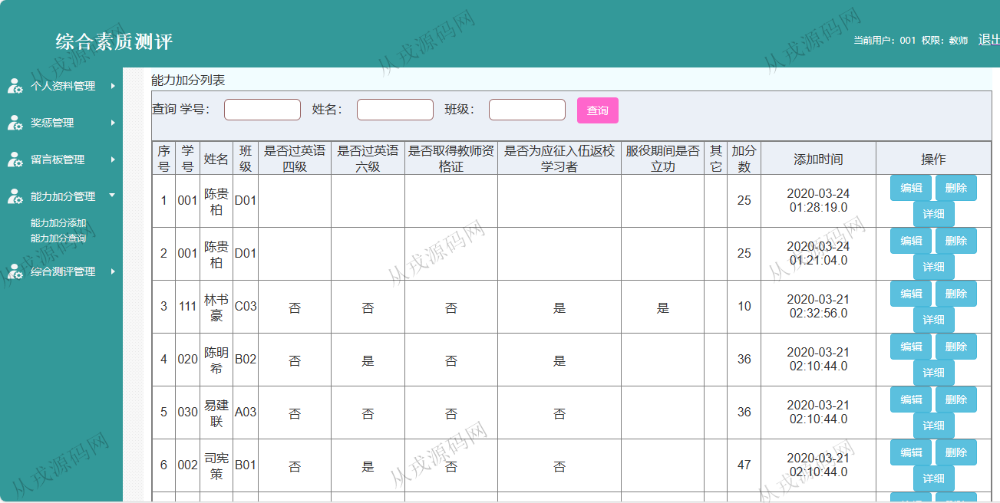

<h1 align="center">157.学生综合素质测评管理系统</h1>

 获取sql文件 QQ: 386869957 QQ群: 377586148 

 [更多源码项目: 从戎源码网](https://armycodes.com/) 

## 简介

> 本代码来源于网络,仅供学习参考使用!
>
> 提供1.远程部署/2.修改代码/3.设计文档指导/4.框架代码讲解等服务
> 
> 访问地址: http://localhost:8080/login.jsp
> 
> 管理员：admin 123456
> 
> 教师：001 123456
> 
> 学生：001 123456
>

## 项目介绍
基于ssm的学生综合素质测评管理系统：前端 jsp、ajax，后端 springmvc、spring、mybatis；角色分为管理员、教师、学生；集成综合评测、学生成绩、学生信息等功能于一体的系统。

## 功能介绍

- 个人资料管理：个人资料信息的查看与修改，密码修改
- 奖惩管理：奖惩信息的增删改查，多条件查询
- 留言板管理：留言信息列表查询，留言详情查看，留言回复
- 能力加分管理：能力加分信息的增删改查，多条件查询
- 综合素质测评管理：测评信息的增删改查
- 学生成绩管理：学生成绩信息的增删改查
- 教师信息管理：教师信息的增删改查
- 学生信息管理：学生信息的增删改查

## 环境

- <b>IntelliJ IDEA 2021.3</b>

- <b>Mysql 5.7.26</b>

- <b>Tomcat 7.0.73</b>

- <b>JDK 1.8</b>

## 运行截图

